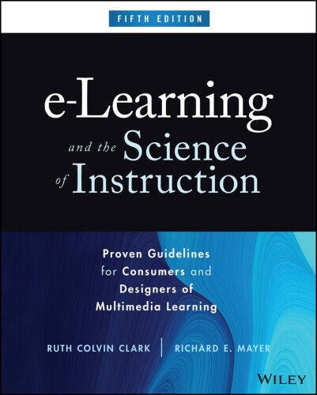
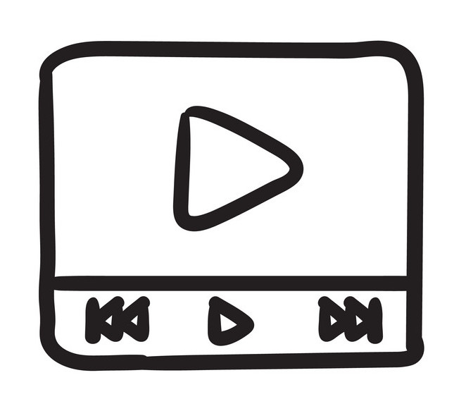

# Designing multimedia learning material

{{}}
{{This presentation is about designing multimedia learning material.}}
{{Much of the learning material that we make, consists mostly of words.}}
{{But a large amount of research over the past 30 years, has shown that learning material is more effective if we use images as well, images that illustrate what our words are saying.}}
{{That is, learning material is more effective if it's multimedia, containing not just words, but also images.}}
{{In this presentation, I'll explain how to design multimedia learning material, in accordance with what the research has found.}}

---

# Multimedia material

{{Multimedia material is material that uses both words and images.}}
{{The words might be written, or spoken, or both.}}
{{And the images might be static, or dynamic, or both.}}
{{What makes it multimedia is that it uses both words and images.}}
{{This presentation uses words. But it hasn't yet used any images. So it's not yet multimedia.}}
{{Even though its words are both written and spoken, it's not multimedia, because it's all just words, and no images.}}

{{Now it uses an image as well. So now it's multimedia.}}
{{Multimedia material can be used for a variety of purposes. But in this presentation, I focus just on using it for learning.}}

[>]

---

# 12 principles

{{I'll be presenting 12 principles about multimedia learning material.}}
{{The principles are supported by both experiment and theory.}}

- Supported by experiment
  {{They're supported by experiment, in the sense that they've been tested in multiple randomised controlled experiments, which have shown effects that are statistically significant, and large.}}

- Supported by theory
  {{They're supported by theory, in the sense that they can be explained by well-established theories in psychology and cognitive science.}}

Richard Mayer

{{One of the main people in the area is Richard Mayer, and the principles are sometimes called "Mayer's principles of multimedia learning".}}

---

# Some good resources

{{If you'd like to learn more about Mayer's principles after this presentation, the following are good places to start.}}

<table>
  <tr>
    <td style="width:20em;padding:2em;vertical-align:top">
      
      

        Mayer, R. E. (2008). Applying the science of learning: Evidence-based principles for the design of multimedia instruction. <i>American Psychologist, 63</i>(8), 760-769.
      

      {{This paper by Mayer is short and clearly written.}}
    </td>
    <td style="width:20em;padding:2em;vertical-align:top">
      
      

        Clark, R., & Mayer, R. E. (2023). E-learning and the science of instruction (5th ed). Wiley.
      

      {{This book by Clark and Mayer is longer and more comprehensive, but it's also clearly written.}}
    </td>
  </tr>
</table>

---

# Learning from multimedia material

{{To understand Mayer's principles, it helps to know how we learn from multimedia material.}}

1. We select
   {{First, we select words and images in the material to attend to}}

2. We organise
   {{Second, we organise those words and images into a coherent thought}}

3. We integrate
   {{Third, we integrate and store that thought with what we already know}}

Using our working memory
{{We do all of this using our working memory.}}

---

# Working memory is extremely limited

{{A key fact about working memory, is that it's extremely limited. We can only process a few items at a time, and they're quickly lost once we stop processing them.}}
{{Because of this, our working memory can easily become overloaded. And when that happens, we stop learning.}}
{{Mayer's principles tell us how to design multimedia learning material, in a way that prevents it from overloading working memory.}}

---

# Working memory has two channels

  {{A second key fact about working memory, is that it has two channels, which operate in parallel.}}
  
Visual channel

  {{We have a visual channel, in which we process images}}
  
Auditory channel

  {{And we have an auditory channel, in which we process sounds}}
  {{Multimedia material allows us to use both channels at the same time, which is why it's so good for learning.}}
  
Images &rarr;

  {{Images are processed in the visual channel.}}
  
Spoken words &rarr;

  {{Spoken words are processed in the auditory channel.}}
  {{Because they're processed in different channels, images and spoken words can be processed at the same time.}}
  {{Written words are more demanding.}}
  
<b>Written words</b> &rarr;

  {{Because we need to read them, written words are processed in the visual channel.}}
  
<b>Written words</b> &rarr;

  {{But reading them turns them into sounds, made by our inner voice, which are processed in the auditory channel.}}
  {{So written words are processed in both the visual and auditory channels, which makes them more demanding on working memory.}}
  {{Because they're processed in the visual channel, they can interfere with our processing of images.}}
  {{And because they're processed in the auditory channel, they can interfere with our processing of spoken words.}}
  {{We'll see the significance of this shortly.}}

{{With this understanding of working memory, and its two channels, we're ready for the 12 principles.}}

[>]

---

# 1. The multimedia principle

{{Principle 1. The multimedia principle}}

**We learn better from words and images, than from words alone**

{{We learn better from words and images, than from words alone}}
{{Here's some material that uses just words.}}

<table class="demo"><tr>
  <td style="width:33%">
    Chad is in central Africa, just above the equator
    {{}}
    {{Here's the same material, with an image as well.}}
  </td>
  <td style="width:33%">
     
    Chad is in central Africa, just above the equator
    {{}}
    {{It's easier to learn from the material when it has the image.}}
    {{Not just any image will do - it needs to illustrate what the words are saying.}}
    {{Here's the material with a different image.}}
  </td>
  <td style="width:33%">
    
    
Chad is in central Africa, just above the equator

    {{}}
    {{This image doesn't help, because it doesn't illustrate what the words are saying. In fact, it hinders learning, because it's a distraction.}}
    {{It might be a good image to attach to different words - words that make a different point. But it's not a good image to attach to these particular words.}}
    {{It's a common mistake, to use images that end up distracting rather than illustrating.}}
  </td>
</tr></table>

[>]

---

# 2. The modality principle

{{Principle 2. The modality principle}}

**We learn better when an image's words are spoken, than when they are written**

{{We learn better when an image's words are spoken, than when they are written}}

<table class="demo">
  <tr>
    <td class="hidden">
      {{Here's some material with an image whose words are spoken.}}
    </td>
    <td style="width:50%">
      
      {{Chad is in central Africa, just above the equator}}
    </td>
    <td class="hidden">
      {{Notice that the spoken words don't draw your attention away from the image. That's because you use your auditory channel to process the spoken words, which leaves your visual channel free to process the image.}}
      {{Here's the material with the image's words written instead.}}
    </td>
    <td>
      
      
Chad is in central Africa, just above the equator

      {{}}
    </td>
    <td class="hidden">
      {{Notice that the words draw your attention away from the image.}}
      {{That's because you use your visual channel to read the written words.}}
      {{This interferes with your processing of the image.}}
    </td>
  </tr>
</table>

[>]

---

# 3. The redundancy principle

{{Principle 3. The redundancy principle}}

**We learn better from images whose words are just spoken, than from images whose words are both spoken and written**

{{We learn better from images whose words are just spoken, than from images whose words are both spoken and written}}

<table class="demo">
  <tr>
    <td class="hidden">
      {{Here's some material in which an image's words are just spoken.}}
    </td>
    <td style="width:25%">
      
      {{Chad is in central Africa, just above the equator}}
    </td>
    <td class="hidden">
      {{As we've already observed, you can process the image while listening to the words, without any interference.}}
      {{Here's the same material, with the words written as well.}}
    </td>
    <td style="width:25%">
      
      
Chad is in central Africa, just above the equator

      {{Chad is in central Africa, just above the equator}}
    </td>
    <td class="hidden">
      {{The written words draw your attention away from the image, and interfere with your processing of it.}}
      {{They also draw your attention away from the spoken words, and interfere with your processing of them.}}
      {{In this case, the written words don't interfere much with your processing of the spoken words, because they're exactly the same.}}
      {{But if the written words are different from the spoken words, they can interfere quite a bit.}}
      {{Here's the material again, but with different written words.}}
    </td>
    <td style="width:25%">
      
      
North of the equator in central Africa is a country called Chad

      {{Chad is in central Africa, just above the equator}}
    </td>
    <td class="hidden">
      {{Notice that in this case the written words interfere quite a bit with your processing of the spoken words.}}
      {{It's not so bad if the written words are short.}}
    </td>
    <td style="width:25%">
      
      
Chad

      {{Chad is in central Africa, just above the equator}}
    </td>
    <td class="hidden">
      {{When the written words are short, you can quickly read them, then return your full attention to the image and spoken words.}}
    </td>
  </tr>
</table>

{{The moral is this:}}
{{If you add an image to some words, try to speak the words, rather than write them.}}
{{Don't write the words as well, unless you write exactly the same words, or a very short abbreviation of them.}}
{{Whatever you do, don't write long words that are different from the spoken words.}}
{{It's a common mistake, to expect people to listen to one set of words, while they're reading some other set of words.}}
{{We can't do it.}}
{{We can either listen, and not read. Or read, and not listen. But we can't do both.}}
{{We might even give up, and do neither.}}

[>]

---

# 4. The temporal contiguity principle

{{Principle 4. The temporal contiguity principle}}

**We learn better when an image's spoken words are presented at the same time as the image**

{{We learn better when an image's spoken words are presented at the same time as the image}}

<table class="demo">
  <tr>
    <td class="hidden">
      {{Here's some material, in which the words are spoken before the image is displayed.}}
    </td>
    <td>
      {{Chad is in central Africa, just above the equator}}
      
      {{}}
    </td>
    <td class="hidden">
      {{Notice that when the image is shown, you have to recall the words, and that adds load to your working memory.}}
    </td>
    <td class="hidden">
      {{Here's the same material, with the words spoken while the image is showing.}}
    </td>
    <td style="width:50%">
      
      {{Chad is in central Africa, just above the equator}}
      {{Now there's no need for you to recall the words, which reduces the load on your working memory, which makes it easier for you to learn.}}
    </td>
  </tr>
</table>

[>]

---

# 5. The signalling principle

{{Principle 5. The signalling principle}}

**We learn better when cues are used to focus our attention**

{{We learn better when cues are used to focus our attention}}

<table class="demo">
  <tr>
    <td class="hidden">
      {{Here's some material without any cues}}
    </td>
    <td style="width:50%">
      
      

      {{Chad is in central Africa, just above the equator.}}
    </td>
    <td class="hidden">
      {{There are two features of this image that the words refer to - Chad, and the equator.}}
      {{Since you're not given any cues, it's up to you to figure out which is which, and where to look while the words are spoken.}}
      {{This adds load to your working memory, and makes it more difficult for you to learn.}}
      {{Here's the same material, but with cues added.}}
    </td>
    <td>
      
      

      
&darr;

      {{Chad is in central Africa.}}
      
&uarr;

      {{Just above the equator.}}
    </td>
    <td class="hidden">
      {{Now it's clear which feature is which, and where you should be looking as the words are spoken.}}
      {{This frees up your working memory, and makes it easier for you to learn.}}
    </td>
  </tr>
</table>

[>]

---

# 6. The voice principle

{{Principle 6. The voice principle}}

**We learn better from a friendly human voice, than from an impersonal computer voice**

{{We learn better from a friendly human voice, than from an impersonal computer voice}}
{{So, if you use a computer voice, use the most friendly and human voice you can find.}}

[>]

---

# 7. The image principle

{{Principle 7. The image principle}}

**We don't necessarily learn better from multimedia material if the speaker's image is added**

{{We don't necessarily learn better from multimedia material if the speaker's image is added}}

<table class="demo">
  <tr>
    <td class="hidden">
      {{Here's some material that includes a video of the speaker.}}
    </td>
    <td style="width:50%">
      
      
Chad is in central Africa, just above the equator

      
      {{}}
    </td>
    <td class="hidden">
      {{Notice that the speaker's image draws your attention away, both from the main image, and from the written words.}}
      {{There's one special case in which it's okay to include an image of the speaker.}}
      {{That's when the material is just spoken words, and there's nothing else to look at.}}
    </td>
    <td style="width:50%">
      
      {{}}
    </td>
    <td class="hidden">
      {{In this special case, it's okay to include an image of the speaker, because there's nothing for it to distract from.}}
    </td>
  </tr>
</table>

[>]

---

# 8. The spatial contiguity principle

{{Principle 8. The spatial contiguity principle}}

**We learn better when an image's written words are presented close to the image**

{{We learn better when an image's written words are presented close to the image}}

<table class="demo">
  <tr>
    <td class="hidden">
      {{Here's some material in which the words are separated from their image, using the standard technique of numbers and a legend.}}
    </td>
    <td style="width:50%">
      
      
1

      
2

      
<ol><li>Chad</li><li>Equator</li></ol>

      {{}}
    </td>
    <td class="hidden">
      {{Notice that it takes you some effort to match the words with the appropriate part of the image. This is effort that you could better spend learning.}}
      {{Here's the same material, but with the words placed on the image.}}
    </td>
    <td>
      
      
Chad

      
Equator

      {{}}
    </td>
    <td class="hidden">
      {{Now it's no longer an effort for you to match the words with the appropriate part of the image, and it's easier for you to learn.}}
    </td>
  </tr>
</table>

[>]

---

# 9. The personalisation principle

{{Principle 9. The personalisation principle}}

**We learn better from words that are conversational, than from words that are formal**

{{We learn better from words that are conversational, than from words that are formal.}}
{{That is, we learn better from words that address us personally, as if we're part of a conversation.}}

<table class="demo">
  <tr>
    <td class="hidden">
      {{Here's some material whose words are formal.}}
    </td>
    <td style="width:50%">
      
      
During the rainy season in Chad it's difficult to travel, so people tend to visit during the dry

      {{During the rainy season in Chad, it's difficult to travel, so people tend to visit during the dry.}}
    </td>
    <td class="hidden">
      {{Here's the same material, but with more conversational words.}}
    </td>
    <td style="width:50%">
      
      
During the rainy season in Chad you might find it difficult to travel, so we suggest that you visit during the dry

      {{During the rainy season in Chad, you might find it difficult to travel, so we suggest that you visit during the dry.}}
    </td>
    <td class="hidden">
      {{These words are more conversational, because they address us personally. This makes them more engaging, and easier to learn from.}}
    </td>
  </tr>
</table>

[>]

---

# 10. The coherence principle

{{Principle 10. The coherence principle}}

**We learn better from material that contains nothing extraneous**

{{We learn better from material that contains nothing extraneous}}

<table class="demo">
  <tr>
    <td class="hidden">
      {{Here's some material that's nice and simple.}}
    </td>
    <td style="width:15em;padding:2em">
      
      
Chad is central Africa, just above the equator

      {{}}
      {{It can be tempting to add extras.}}
      
(The sprinter Kaltouma Nadjina is from Chad)

      {{Perhaps an interesting fact.}}
      
Endeavour University

      {{Perhaps a banner.}}
      
James Cook School of Geography

      {{Perhaps some author information.}}
      

      {{Perhaps a background pattern.}}
      
      {{And, if words are spoken, perhaps an image of the speaker.}}
      {{But none of these additions help with learning.}}
      {{In fact, they make it more difficult, because they're distractions, and they use up precious working memory.}}
      {{It's better for learning to use the simple material that we started with.}}
    </td>
  </tr>
</table>

[>]

---

# 11. The segmenting principle

{{Principle 11. The segmenting principle}}

**We learn better from material when we can control the pace at which it is presented**

{{We learn better from material when we can control the pace at which it is presented}}

<table><tr>
  <td style="width:50%">
    
    {{If the material is static, as it is in a book, or a pdf, then we automatically get this control.}}
  </td>
  <td style="width:50%">
    
    {{But if the material is dynamic, as it is in a video, then we need to be given the same kind of control, by being able to pause, jump around, and adjust the playback speed.}}
  </td>
</tr></table>

[>]

---

# 12. The pretraining principle

{{Principle 12. The pretraining principle}}

**We learn better from material if we're already familiar with its main concepts**

{{We learn better from material if we're already familiar with its main concepts}}
{{Here's some material that involves the concept of the equator.}}

<table class="demo"><tr>
  <td style="">
    
    
Chad is in central Africa, just above the equator

    {{}}
  </td>
</tr></table>

{{You're already familiar with the concept of the equator, so it takes you little effort to understand and process this material.}}
{{But if you weren't, it would take you more effort, and make it harder for you to learn.}}
{{In that case, it would help for you to be given some pretraining about what the equator is, before using this material.}}

[>]

---

# The principles as advice

{{Those are the 12 principles.}}
{{Here they are again, this time presented as pieces of advice.}}

<table class="regular">
  <tr><td>1.</td><td>
    Wherever possible, illustrate your words with an image.
    {{Wherever possible, illustrate your words with an image}}
  </td><!--<td>
    Multimedia
    {{That's the multimedia principle}}
  </td>--></tr><tr><td>2.</td><td>
    Then, if you can, speak the words, instead of writing them.
    {{Then, if you can, speak the words, instead of writing them}}
  </td><!--<td>
    Modality
    {{That's the modality principle}}
  </td>--></tr><tr><td>3.</td><td>
    If you speak the words, don't write them as well, unless they're exactly the same, or a very short abbreviation.
    {{If you speak the words, don't write them as well, unless they're exactly the same, or a very short abbreviation}}
  </td><!--<td>
    Redundancy
    {{That's the redundancy principle}}
  </td>--></tr><tr><td>4.</td><td>
    If you speak the words, speak them while the image is showing.
    {{If you speak the words, speak them while the image is showing}}
  </td><!--<td>
    Temporal contiguity
    {{That's the temporal contiguity principle}}
  </td>--></tr><tr><td>5.</td><td>
    If you speak the words, and there are multiple images showing, highlight the relevant one.
    {{If you speak the words, and there are multiple images showing, highlight the relevant one}}
  </td><!--<td>
    Signalling
    {{That's the signalling principle}}
  </td>--></tr><tr><td>6.</td><td>
    If you speak the words, use a natural human voice.
    {{If you speak the words, use a natural human voice}}
  </td><!--<td>
    Voice
    {{That's the voice principle}}
  </td>--></tr><tr><td>7.</td><td>
    If you speak the words, don't add an image of yourself, unless nothing else is showing at the time.
    {{If you speak the words, don't add an image of yourself, unless nothing else is showing at the time}}
  </td><!--<td>
    Image
    {{That's the image principle}}
  </td>--></tr><tr><td>8.</td><td>
    If you can't speak the words, and have to write them, put them close to the image.
    {{If you can't speak the words, and have to write them, put them close to the image}}
  </td><!--<td>
    Spatial contiguity
    {{That's the spatial contiguity principle}}
  </td>--></tr><tr><td>9.</td><td>
    Regardless of whether you speak or write the words, make them conversational, not formal.
    {{Regardless of whether you speak or write the words, make them conversational, not formal}}
  </td><!--<td>
    Personalisation
    {{That's the personalisation principle}}
  </td>--></tr><tr><td>10.</td><td>
    Get rid of everything that's not essential.
    {{Get rid of everything that's not essential}}
  </td><!--<td>
    Coherence
    {{That's the coherence principle}}
  </td>--></tr><tr><td>11.</td><td>
    Make sure that users can work at their own pace.
    {{Make sure that users can work at their own pace}}
  </td><!--<td>
    Segmenting
    {{That's the segmenting principle}}
  </td>--></tr><tr><td>12.</td><td>
    If necessary, explain the main concepts in some preparation material.
    {{Finally, if necessary, explain the main concepts in some preparation material}}
  </td><!--<td>
    Pretraining
    {{That's the pretraining principle}}
  </td>--></tr>
</table>

{{Those are the 12 principles, presented as pieces of advice.}}
{{If you design your learning material in accordance with them, it can be more effective.}}

