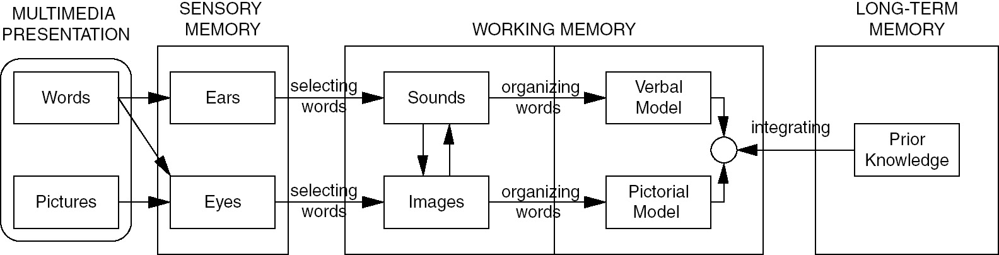

# Making Multimedia Presentations

{{This is a workshop about making multimedia presentations.}}

---

# What is a multimedia presentations?

{{}}

---

# How our brains work

{{It helps to know a bit about how our brains work.}}

{{Here's a diagram that explains it.}}

[>]

---

# Principle 1

## Use both words and images

{{Principle 1: Use both words and images.}}
{{We learn better from words and images and words together, than we do from words alone, or from images alone.}}
